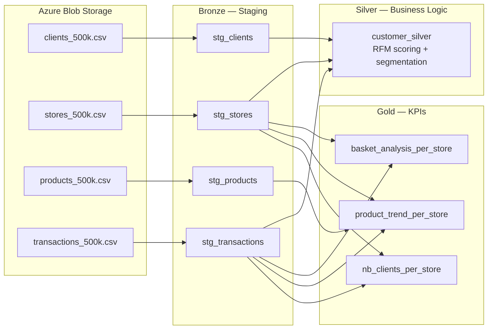

# Vusion Data Platform

Production-grade retail data pipeline for Vusion, a global leader in digital solutions for physical commerce. This project migrates a PySpark-based ETL pipeline to **dbt + Databricks**, implementing a medallion architecture (Bronze / Silver / Gold) with full data quality testing, documentation, and orchestration.

## Architecture



| Layer | Models | Materialization | Purpose |
|-------|--------|-----------------|---------|
| **Bronze** (staging) | `stg_clients`, `stg_stores`, `stg_products`, `stg_transactions` | View | 1:1 with source CSVs. Type casting, date normalization, sign correction. |
| **Silver** | `customer_silver` | Table | RFM scoring, customer segmentation, lifecycle status, store loyalty. |
| **Gold** | `basket_analysis_per_store`, `product_trend_per_store`, `nb_clients_per_store` | Table | Store-level KPIs ready for dashboards and downstream analytics. |

## Quick Start

```bash
# Prerequisites: mise (https://mise.jdx.dev)

# Install tools (Python 3.12, uv, mprocs)
mise install

# Bootstrap: sync dbt deps + install pre-commit hooks
mise run setup

# Build all dbt models + run tests
mise run dbt

# Run full CI check (ruff + dbt build + benchmarks)
mise run check

# Serve MkDocs documentation (localhost:8100)
mise run docs

# Serve dbt documentation (localhost:8200)
mise run dbt:docs

# Run benchmark queries
mise run benchmark
```

## Project Structure

```
vusion/
├── data/                          # Source CSV files (simulating Azure Blob Storage)
│   ├── clients_500k.csv
│   ├── stores_500k.csv
│   ├── products_500k.csv
│   └── transactions_500k.csv
├── dbt_project/                   # dbt models, tests, macros, schema docs
│   ├── models/
│   │   ├── staging/               # Bronze layer (views)
│   │   ├── silver/                # Silver layer (tables)
│   │   └── gold/                  # Gold layer (tables)
│   ├── tests/                     # Singular + generic data quality tests
│   ├── macros/                    # optimize_tables macro
│   ├── profiles.yml               # DuckDB (dev) + Databricks (prod)
│   └── dbt_project.yml
├── airflow/                       # Airflow DAGs for Databricks orchestration
│   └── dags/
│       └── vusion_dbt_pipeline.py
├── databricks/                    # Databricks job configuration
│   └── job_config.json
├── benchmarks/                    # Query performance benchmarks (pytest)
│   └── benchmark_queries.py
├── docs/                          # MkDocs content (symlinked READMEs)
├── mise.toml                      # Tool versions and task definitions
├── mkdocs.yml                     # MkDocs Material configuration
├── ruff.toml                      # Ruff linter configuration
└── .pre-commit-config.yaml        # Pre-commit hooks (ruff + dbt build + benchmarks)
```

## Optimizations and Data Quality

### Bug Fix: `gold_datamart_kpis.py` Join Error

The original PySpark reference implementation contains a join bug in `product_trend_per_store` (line 265 of `gold_datamart_kpis.py`):

```python
# ORIGINAL (buggy): joins stores on product_id instead of store_id
.join(
    stores_df.select("id", "type"),
    F.col("store_id") == F.col("product_id"),   # <-- wrong column
    "left"
)
```

This was fixed in the dbt translation at `dbt_project/models/gold/product_trend_per_store.sql`:

```sql
-- FIXED: join stores on store_id
left join stores s on wt.store_id = s.store_id
```

### Sign Correction

Transaction records can have inconsistent signs between `quantity` and `spend` (e.g., quantity positive but spend negative). The staging layer uses `quantity`'s sign as the source of truth and corrects `spend` to match. A boolean flag `is_sign_corrected` tracks affected rows.

### Store Type Normalization

Store types (`express`, `hyper`, `super`, `supermarket`) arrive with inconsistent casing across file drops. The staging layer normalizes to lowercase via `lower(trim(...))`.

### Date Format Handling

Transaction dates can arrive in multiple formats (`YYYY-MM-DD`, `DD/MM/YYYY`, `MM-DD-YYYY`) across different file drops. DuckDB's `cast(... as date)` handles the primary format; the staging model filters out unparseable rows.

### Missing Column Handling

- `clients`: The `account_id` (fidelity card number) may be absent in some file drops. Handled as nullable.
- `stores`: Explicit `latitude`/`longitude` columns may be missing. Falls back to parsing the `latlng` string field.

### Table Optimization Policy (Databricks)

| Table | Z-ORDER Columns | Partitioning |
|-------|----------------|--------------|
| `customer_silver` | `client_id`, `rfm_segment`, `customer_status` | None (500K rows) |
| `basket_analysis_per_store` | `store_id`, `store_type` | None (aggregated) |
| `product_trend_per_store` | `store_id`, `product_id`, `trend_direction` | None (aggregated) |
| `nb_clients_per_store` | `store_id`, `store_type` | None (aggregated) |
| `stg_transactions` (if materialized) | `transaction_date`, `client_id`, `store_id` | `PARTITION BY (transaction_date)` |

**At scale (billions of rows):**

- Partition transactions by month (truncated `transaction_date`)
- Consider liquid clustering as a replacement for Z-ORDER
- Schedule OPTIMIZE weekly rather than on every run
- Use VACUUM to clean up old files after OPTIMIZE

## Data Quality Approach

Data quality is a first-class concern, not an afterthought. The project uses three layers of testing:

1. **Schema tests** -- `unique`, `not_null`, `relationships`, `accepted_values` on all models via YAML config
2. **Singular tests** -- custom SQL assertions for sign consistency, RFM score bounds, and loyalty score ranges
3. **Generic tests** -- reusable `sign_consistency`, `positive_value`, and `valid_date_range` macros
4. **Unit tests** -- dbt unit tests for RFM scoring logic (Champion segment, New lifecycle, Churned status)

Six known data quality issues are handled in staging:

| Issue | Source | Resolution |
|-------|--------|------------|
| Missing `account_id` column | `clients_500k.csv` | Nullable cast |
| Inconsistent store type casing | `stores_500k.csv` | `lower(trim(...))` |
| Missing `latitude`/`longitude` columns | `stores_500k.csv` | Fallback to `latlng` parsing |
| Inconsistent brand naming | `products_500k.csv` | `trim(...)` normalization |
| Multiple date formats | `transactions_500k.csv` | `cast(... as date)` normalization |
| Sign inconsistency (quantity vs spend) | `transactions_500k.csv` | Sign correction with flag |

## CI/CD

The project uses pre-commit hooks as the local CI equivalent:

| Hook | Scope | What it checks |
|------|-------|----------------|
| `ruff-format` | `*.py` (excl. reference) | Python formatting |
| `ruff-check` | `*.py` (excl. reference) | Python linting with auto-fix |
| `dbt-build` | `dbt_project/` | Full dbt build (models + tests) on DuckDB |
| `pytest-benchmarks` | `benchmarks/` | Benchmark query execution and assertions |

Run the full check manually:

```bash
mise run check
```

## Dual-Target Strategy

The project targets two environments with the same SQL:

- **Local development**: DuckDB (fast, zero-config, file-based)
- **Production**: Databricks + Unity Catalog + Delta Lake

Databricks-specific features (OPTIMIZE, Z-ORDER, VACUUM) are wrapped in target-aware macros that are no-ops on DuckDB. The `profiles.yml` contains both profiles; CI runs against DuckDB, production against Databricks.

## License

See [LICENSE](LICENSE).
