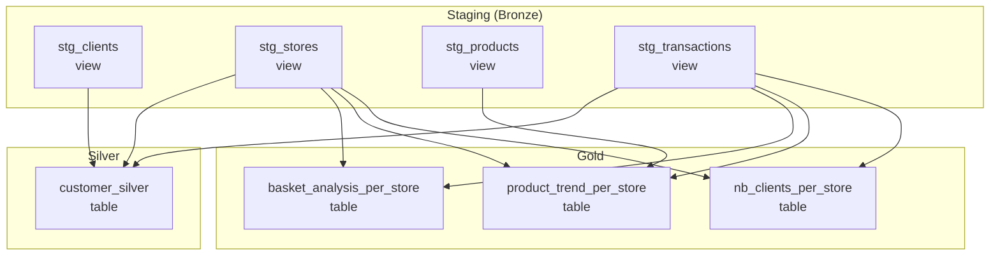

# dbt Project

dbt transformation layer for the Vusion retail data platform. Implements a medallion architecture (staging / silver / gold) with full schema documentation, data quality tests, and unit tests. Runs on DuckDB locally and Databricks in production.

## Model Layers



### Staging (Bronze)

1:1 mappings from source CSVs. Materialized as **views** (no storage cost, always fresh). Each model handles its own data quality fixes:

| Model | Source File | Key Transformations |
|-------|-----------|---------------------|
| `stg_clients` | `clients_500k.csv` | Type casting, nullable `account_id`, null filtering |
| `stg_stores` | `stores_500k.csv` | Store type normalization (`lower(trim(...))`), lat/lng extraction from `latlng` field |
| `stg_products` | `products_500k.csv` | Brand trimming, type casting, null filtering |
| `stg_transactions` | `transactions_500k.csv` | Date normalization, sign correction (quantity drives spend sign), zero-quantity exclusion |

### Silver

Business logic layer. Materialized as **tables** for performance.

**`customer_silver`** -- RFM (Recency, Frequency, Monetary) customer analytics:

- RFM metrics computed from transaction history
- 1-5 scoring scale with fixed thresholds (matching PySpark reference)
- 8 customer segments: Champion, Loyal Customer, At Risk, Lost, Hibernating, Need Attention, About to Sleep, Potential Loyalist
- Customer status (Active/Inactive/Churned) and lifecycle stage (New/Active/Lapsed/Churned)
- Primary store preference with loyalty score (% of transactions at top store)

### Gold

KPI aggregates for dashboards and downstream analytics. Materialized as **tables**.

| Model | Description | Key Metrics |
|-------|-------------|-------------|
| `basket_analysis_per_store` | Store-level basket KPIs | avg/min/max/stddev basket size, item count, total transactions |
| `product_trend_per_store` | Product sales trends with 30/60/90d windows | sales velocity, trend direction, percentage change |
| `nb_clients_per_store` | Client engagement per store | unique clients, avg transactions per client, total quantity |

## Data Quality Tests

### Known Issues and Resolutions

The source data contains six known quality issues. All are handled in the staging layer:

| # | Issue | Where | How It Is Handled | Test Coverage |
|---|-------|-------|-------------------|---------------|
| 1 | Missing `account_id` column | `clients_500k.csv` | Nullable cast in `stg_clients` | Schema test: `account_id` allows null |
| 2 | Inconsistent store type casing | `stores_500k.csv` | `lower(trim(...))` in `stg_stores` | `accepted_values` test on `store_type` |
| 3 | Missing `latitude`/`longitude` columns | `stores_500k.csv` | Fallback to `latlng` string parsing in `stg_stores` | `not_null` (warn) on `latitude`/`longitude` |
| 4 | Inconsistent brand naming | `products_500k.csv` | `trim(...)` in `stg_products` | `not_null` on `brand` |
| 5 | Multiple date formats | `transactions_500k.csv` | `cast(... as date)` in `stg_transactions` | `valid_date_range` generic test, `not_null` on `transaction_date` |
| 6 | Sign inconsistency (quantity vs spend) | `transactions_500k.csv` | Quantity sign drives spend correction in `stg_transactions` | `sign_consistency` generic test, singular sign assertion |

### Test Types

**Schema tests** (defined in YAML):

- `unique`, `not_null` on all primary keys and required fields
- `relationships` on foreign keys (client_id, product_id, store_id) with `warn` severity
- `accepted_values` on categorical fields (store_type, rfm_segment, customer_status, trend_direction)

**Singular tests** (`tests/`):

- `assert_sign_corrected_transactions_have_consistent_signs` -- post-correction, quantity and spend must agree
- `assert_rfm_scores_within_bounds` -- all RFM scores between 1 and 5
- `assert_store_loyalty_score_within_range` -- loyalty score between 0 and 100

**Generic tests** (`tests/generic/`):

- `sign_consistency(column, compare_column)` -- two columns must share the same sign
- `positive_value(column)` -- column must be >= 0
- `valid_date_range(column, min_date, max_date)` -- date must fall within a reasonable range

## Unit Tests

dbt unit tests validate transformation logic with fixed input data. Defined in `models/silver/_silver_unit_tests.yml`:

| Test | What It Validates |
|------|-------------------|
| `test_rfm_segment_champion` | High-frequency, high-recency, high-monetary client is classified as Champion |
| `test_customer_lifecycle_new` | Client with exactly one transaction is classified as New lifecycle stage |
| `test_customer_status_churned` | Client with only old transactions (200+ days) is classified as Churned |

Run unit tests:

```bash
mise run dbt:test
```

## Table Optimization Policy

Delta Lake optimization for Databricks production. Implemented as a dbt macro in `macros/optimize_tables.sql` (no-op on DuckDB).

| Table | Z-ORDER Columns | Partitioning | Rationale |
|-------|----------------|--------------|-----------|
| `customer_silver` | `client_id`, `rfm_segment`, `customer_status` | None | 500K rows; Z-ORDER sufficient for filter/join queries |
| `basket_analysis_per_store` | `store_id`, `store_type` | None | Small aggregate; fits in a few files |
| `product_trend_per_store` | `store_id`, `product_id`, `trend_direction` | None | Aggregate; multi-column filter patterns |
| `nb_clients_per_store` | `store_id`, `store_type` | None | Small aggregate |
| `stg_transactions` (if materialized) | `transaction_date`, `client_id`, `store_id` | `PARTITION BY (transaction_date)` | Largest table; date partitioning for time-range queries |

**Scaling considerations:**

- At billions of rows, partition transactions by month (truncated date) to avoid over-partitioning
- Evaluate liquid clustering as a Z-ORDER replacement for more adaptive data organization
- Schedule OPTIMIZE weekly instead of per-run to avoid overhead
- Run VACUUM after OPTIMIZE to reclaim storage from stale files

## How to Run Locally

```bash
# Install tools
mise install

# Bootstrap dependencies
mise run setup

# Full build (models + all tests)
mise run dbt

# Models only (skip tests)
mise run dbt:run

# Tests only (requires models to be built)
mise run dbt:test

# Generate and serve dbt docs (localhost:8200)
mise run dbt:docs
```

### Profiles

- **dev** (default): DuckDB at `target/vusion.duckdb`. Zero-config, file-based.
- **prod** (commented out): Databricks + Unity Catalog. Requires `DATABRICKS_HOST`, `DATABRICKS_HTTP_PATH`, `DATABRICKS_TOKEN` environment variables.
