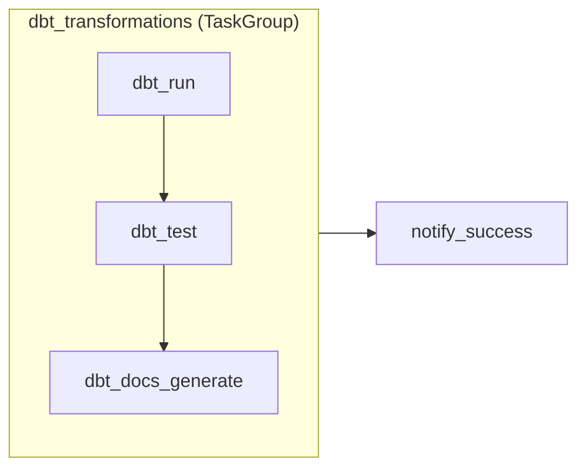
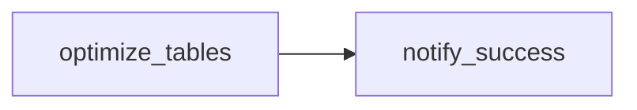
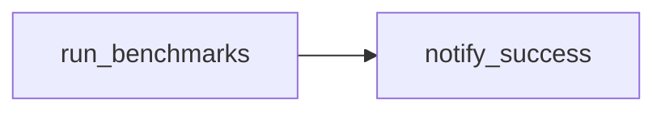

# Airflow Orchestration

Airflow DAGs for orchestrating the Vusion data platform on Databricks. Follows the principle of **orchestration-only**: Airflow submits and monitors Databricks jobs but never runs dbt or data transformations directly.

Two DAGs with separate concerns:

- **`deep_rayon_dbt_pipeline`** -- Daily dbt transformations (run, test, docs)
- **`deep_rayon_optimize`** -- Weekly Delta table maintenance (OPTIMIZE + Z-ORDER)
- **`deep_rayon_benchmark`** -- Manual-trigger performance benchmarks

## DAG: `deep_rayon_dbt_pipeline`

| Property | Value |
|----------|-------|
| Schedule | Daily at 03:00 Europe/Paris |
| Max concurrent runs | 1 |
| Catchup | Disabled |
| Default retries | 2 (5-minute delay) |
| Execution timeout | 2 hours |
| Failure notification | `data-engineering@vusion.com` |

## Task Flow



### Task Descriptions

| Task | Operator | What It Does |
|------|----------|--------------|
| `dbt_run` | `DatabricksRunNowOperator` | Execute dbt models (bronze, silver, gold) |
| `dbt_test` | `DatabricksRunNowOperator` | Run all dbt data quality tests |
| `dbt_docs_generate` | `DatabricksRunNowOperator` | Generate dbt documentation catalog |
| `notify_success` | `PythonOperator` | Send completion notification (placeholder for Slack/Teams) |

The first three tasks are grouped in a `TaskGroup` named `dbt_transformations` for visual clarity in the Airflow UI. The notification fires after all dbt tasks complete.

## Databricks Operators

The DAG uses operators from `apache-airflow-providers-databricks`:

- **`DatabricksRunNowOperator`** -- Triggers an existing Databricks job by ID and waits for completion. Each task passes different `notebook_params` to control which dbt command runs (`run`, `test`, or `docs generate`).
- **`DatabricksPartitionSensor`** -- Used in the mock plugin (`mock_databricks.py`) for local testing. Reserved for future use in the DAG (e.g., waiting for upstream data partitions before triggering the pipeline).

### Why `wait_for_termination` instead of separate sensors

The DAG uses `wait_for_termination=True` on each operator rather than separate `DatabricksRunSensor` tasks. This is a deliberate design choice:

| Aspect | Separate sensors | `wait_for_termination=True` |
|--------|-----------------|---------------------------|
| DAG complexity | 8 tasks (4 operators + 4 sensors) | 4 tasks |
| Error handling | Must handle sensor timeout + job failure separately | Job failure = task failure, single error path |
| Run ID passing | Must pass `run_id` via XCom from operator to sensor | Not needed — same task handles submit + poll |
| Behavior | Identical | Identical |

Both approaches poll the Databricks API until the job finishes. The `wait_for_termination` approach is simpler: fewer tasks, no XCom plumbing, and one error path per task. A separate sensor would only be useful if the DAG needed to do other work while waiting — but in our sequential pipeline, each step depends on the previous one completing.

Key configuration:

```python
DatabricksRunNowOperator(
    databricks_conn_id="databricks_default",    # Airflow connection
    job_id="{{ var.value.deep_rayon_dbt_job_id }}",  # Templated from Airflow variable
    wait_for_termination=True,                   # Synchronous execution
    polling_period_seconds=30,                   # Check status every 30s
)
```

The Databricks job ID is stored as an Airflow variable (`deep_rayon_dbt_job_id`) rather than hardcoded, allowing environment-specific configuration without code changes.

## Error Handling

### Retry Policy

| Level | Retries | Delay | Timeout |
|-------|---------|-------|---------|
| DAG default | 2 | 5 minutes | 2 hours |
| Databricks job (dbt_run) | 2 | 60 seconds | 1 hour |
| Databricks job (dbt_test) | 1 | 30 seconds | 30 minutes |
| Databricks job (docs) | 1 | 30 seconds | 15 minutes |

### Failure Callbacks

- **DAG-level `on_failure_callback`**: Calls `send_notification(context, status="failure")` which logs the failing DAG, task, and execution date. This is a placeholder for integration with Slack, Microsoft Teams, or PagerDuty.
- **Email notification**: Configured via `default_args` to send to `data-engineering@vusion.com` on task failure.

### Design Decisions

1. **Orchestration-only** -- Airflow manages job submission and monitoring. dbt and its Python dependencies live in the Databricks environment, not in Airflow. This avoids dependency conflicts and keeps the Airflow deployment lightweight.

2. **Single Databricks job** -- All tasks reference the same `job_id` with different parameters. This maps to the multi-task Databricks job defined in `resources/deep_rayon_dbt_pipeline.yml`. Airflow controls the execution order; Databricks handles compute. Delta optimization runs as a separate job/DAG (`deep_rayon_optimize`) on a weekly schedule.

3. **No catchup** -- The pipeline processes a full snapshot (not incremental), so historical runs would duplicate work without benefit.

4. **XCom push** -- `dbt_run` and `dbt_test` push results to XCom for downstream tasks or monitoring integrations to inspect run metadata.

## DAG: `deep_rayon_optimize`

Weekly Delta table maintenance, decoupled from the daily dbt pipeline.

| Property | Value |
|----------|-------|
| Schedule | Weekly on Sunday at 05:00 Europe/Paris |
| Max concurrent runs | 1 |
| Catchup | Disabled |
| Default retries | 2 (5-minute delay) |
| Execution timeout | 1 hour |
| Failure notification | `data-engineering@vusion.com` |

### Task Flow



| Task | Operator | What It Does |
|------|----------|--------------|
| `optimize_tables` | `DatabricksRunNowOperator` | Run OPTIMIZE + Z-ORDER on silver and gold Delta tables |
| `notify_success` | `PythonOperator` | Send completion notification |

### Why a separate DAG?

- **OPTIMIZE is expensive** -- compaction and Z-ORDER rewriting on large Delta tables consumes significant compute
- **Weekly is sufficient** -- at the current data volume (500K rows), query performance does not degrade within a week of writes
- **Independent scheduling** -- frequency can be adjusted (daily during high-ingestion periods, monthly during low-activity) without touching the dbt pipeline
- **Cleaner failure isolation** -- an optimization failure does not block or delay the daily dbt pipeline

The job ID is stored in a separate Airflow variable (`deep_rayon_optimize_job_id`) to allow independent deployment and configuration.

## DAG: `deep_rayon_benchmark`

Manual-trigger DAG for running performance benchmark queries against dbt-built tables.

| Property | Value |
|----------|-------|
| Schedule | None (manual trigger only) |
| Max concurrent runs | 1 |
| Catchup | Disabled |
| Default retries | 0 |
| Execution timeout | 1 hour |
| Failure notification | `data-engineering@vusion.com` |

### Task Flow



| Task | Operator | What It Does |
|------|----------|--------------|
| `run_benchmarks` | `DatabricksRunNowOperator` | Submit the benchmark Databricks job (Python wheel with 4 JOIN-heavy queries) |
| `notify_success` | `PythonOperator` | Send completion notification |

### Usage

Trigger from the Airflow UI ("Trigger DAG" button) or CLI:

```bash
airflow dags trigger deep_rayon_benchmark
```

Typically run after the dbt pipeline completes to measure query performance on freshly built tables. Results (duration, files scanned, estimated cost) are pushed to XCom and logged.

## Local Development (Docker Compose)

A local Airflow instance runs via Docker Compose using `airflow standalone` — a single container with webserver, scheduler, and SQLite. No Databricks workspace required: the mock plugin (`plugins/mock_databricks.py`) patches Databricks operators so tasks log their parameters and succeed immediately.

### Quick Start

```bash
# Start Airflow (builds image, streams logs)
mise run airflow

# Open the Airflow UI
open http://localhost:8080    # Login: admin / admin
```

Or via mprocs (alongside docs, dbt-docs, dbt-build):

```bash
mprocs
```

### What You Can Test Locally

| What | How |
|------|-----|
| DAG parses without errors | Check "DAGs" page — no import errors |
| Task dependency graph | Click the DAG → "Graph" tab |
| Trigger a full run | Click "Trigger DAG" (DAGs are unpaused by default) |
| Task logs | Click any task instance → "Logs" tab |
| XCom values | Admin → XComs (mock returns `run_id`, `state`, `params`) |
| Failure callbacks | Force-fail a task to verify `on_failure_callback` fires |
| Schedule / catchup config | Check "DAG Details" for schedule and catchup settings |

### How Mock Operators Work

The `plugins/mock_databricks.py` file monkey-patches the `execute` method at import time:

- `DatabricksRunNowOperator` → logs job ID and notebook params, sleeps 2s, returns a mock result
- `DatabricksPartitionSensor` → immediately returns `True`

The DAG source code (`dags/deep_rayon_dbt_pipeline.py`) is **unchanged** — the same file runs in production with real Databricks operators.

### Stop Airflow

```bash
mise run airflow:down
```

### File Layout

```
airflow/
├── dags/
│   ├── deep_rayon_dbt_pipeline.py    # Daily dbt pipeline DAG
│   ├── deep_rayon_optimize.py        # Weekly Delta optimization DAG
│   └── deep_rayon_benchmark.py       # Manual benchmark DAG
├── plugins/
│   └── mock_databricks.py        # Mock Databricks operators for local dev
├── docker-compose.yml             # Single-container Airflow (standalone)
└── Dockerfile                     # Image with Databricks provider + mock plugin
```
