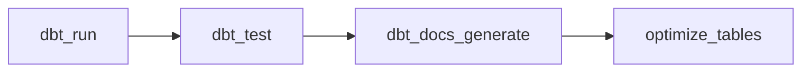

# Databricks Asset Bundle

Databricks Asset Bundle (DAB) for the Vusion dbt pipeline. Declarative YAML format with multi-target deployment (dev/prod) and CI/CD via `databricks bundle deploy`.

## Bundle Structure

```
vusion/
├── databricks.yml                          # Bundle config (targets, variables)
└── resources/
    ├── vusion_dbt_pipeline.yml             # dbt pipeline job (daily)
    └── vusion_benchmark.yml                # Benchmark job (manual trigger)
```

## Jobs

### `vusion_dbt_pipeline` — Daily dbt Pipeline



| Task | Type | Timeout | Retries |
|------|------|---------|---------|
| `dbt_run` | `dbt_task` | 1 hour | 2 |
| `dbt_test` | `dbt_task` | 30 min | 1 |
| `dbt_docs_generate` | `dbt_task` | 15 min | 1 |
| `optimize_tables` | `dbt_task` | 30 min | 1 |

All tasks use the `dbt_task` type (Databricks-native dbt CLI support). The dbt CLI process runs on a **single-node job cluster** (`dbt_cli`); the actual SQL queries execute on the **SQL warehouse** referenced by `warehouse_id`. The `optimize_tables` task runs `dbt run-operation generate_optimization_statements` to apply OPTIMIZE + Z-ORDER via the dbt macro.

Schedule: daily at 03:00 Europe/Paris, max 1 concurrent run, 2-hour global timeout.

### `vusion_benchmark` — Performance Benchmarks

| Task | Type | Timeout | Retries |
|------|------|---------|---------|
| `run_benchmarks` | `python_wheel_task` | 10 min | 0 |

Runs 4 JOIN-heavy benchmark queries and measures duration, files scanned, and estimated cost. Deployed as a Python wheel (`dist/vusion-*.whl`). Triggered manually after the dbt pipeline completes:

```bash
databricks bundle run vusion_benchmark
```

## Targets

| Target | Mode | Schedule | Prefix | Use |
|--------|------|----------|--------|-----|
| `dev` | development | Paused | `[dev username]` | Local development, each developer gets their own copy |
| `prod` | production | Active | None | CI/CD deployment under `/Shared/.bundle/prod/` |

## Variables

| Variable | Description | Required |
|----------|-------------|----------|
| `warehouse_id` | SQL warehouse ID for dbt and SQL tasks | Yes |
| `notification_email` | Failure notification email | No (default: `data-engineering@vusion.com`) |

Set via environment variables or `.databrickscfg`:

- `DATABRICKS_HOST` — Workspace URL
- `DATABRICKS_DEV_WAREHOUSE_ID` / `DATABRICKS_PROD_WAREHOUSE_ID` — SQL warehouse IDs per target
- `DATABRICKS_SP_NAME` — Service principal for production `run_as`

## Deployment

### Local (development)

```bash
# Validate the bundle config
databricks bundle validate --target dev

# Deploy your dev copy (prefixed with [dev username])
databricks bundle deploy --target dev

# Trigger a manual run
databricks bundle run --target dev vusion_dbt_pipeline
```

### CI/CD (production)

Production deployment is handled by GitHub Actions on merge to `main`:

1. **CI** (on PR): `databricks bundle validate --target prod`
2. **CD** (on merge): `databricks bundle deploy --target prod`

### Required GitHub Secrets

| Secret/Variable | Description |
|-----------------|-------------|
| `DATABRICKS_HOST` | Workspace URL (e.g., `https://adb-123.azuredatabricks.net`) |
| `DATABRICKS_TOKEN` | PAT or service principal token |
| `DATABRICKS_PROD_WAREHOUSE_ID` | SQL warehouse ID for prod |
| `DATABRICKS_SP_NAME` | Service principal name for `run_as` |
