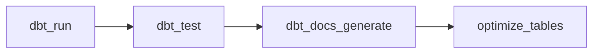

# Databricks Asset Bundle

Databricks Asset Bundle (DAB) for the Vusion dbt pipeline. Declarative YAML format with multi-target deployment (dev/prod) and CI/CD via `databricks bundle deploy`.

## Bundle Structure

```
deep-rayon/
├── databricks.yml                          # Bundle config (targets, variables)
└── resources/
    ├── deep_rayon_dbt_pipeline.yml             # dbt pipeline job (daily)
    └── deep_rayon_benchmark.yml                # Benchmark job (manual trigger)
```

## Jobs

### `deep_rayon_dbt_pipeline` — Daily dbt Pipeline



| Task | Type | Retries |
|------|------|---------|
| `dbt_run` | `dbt_task` | 2 |
| `dbt_test` | `dbt_task` | 1 |
| `dbt_docs_generate` | `dbt_task` | 1 |
| `optimize_tables` | `dbt_task` | 1 |

All tasks use the `dbt_task` type (Databricks-native dbt CLI support). The dbt CLI process runs on a **single-node job cluster** (`dbt_cli`); the actual SQL queries execute on the **SQL warehouse** referenced by `warehouse_id`. The `optimize_tables` task runs `dbt run-operation generate_optimization_statements` to apply OPTIMIZE + Z-ORDER via the dbt macro.

Schedule: daily at 03:00 Europe/Paris, max 1 concurrent run.

### `deep_rayon_benchmark` — Performance Benchmarks

| Task | Type | Retries |
|------|------|---------|
| `run_benchmarks` | `python_wheel_task` | 0 |

Runs 4 JOIN-heavy benchmark queries and measures duration, files scanned, and estimated cost. Deployed as a Python wheel (`dist/deep_rayon-*.whl`). Triggered manually after the dbt pipeline completes:

```bash
databricks bundle run deep_rayon_benchmark
```

## Targets

| Target | Mode | Schedule | Prefix | Use |
|--------|------|----------|--------|-----|
| `dev` | development | Paused | `[dev username]` | Local development, each developer gets their own copy |
| `prod` | production | Active | None | CI/CD deployment under `/Shared/.bundle/prod/` |

## Variables

| Variable | Description | Dev default | Prod default |
|----------|-------------|-------------|--------------|
| `warehouse_id` | SQL warehouse ID for dbt and SQL tasks | `BUNDLE_VAR_warehouse_id` | `BUNDLE_VAR_warehouse_id` |
| `data_path` | Path to source CSV files | `/FileStore/data` | `abfss://<container>@<storage_account>.dfs.core.windows.net/data` |
| `notification_email` | Failure notification email | `data-engineering@vusion.com` | `data-engineering@vusion.com` |

Each target in `databricks.yml` sets its own `data_path`. The dbt job passes it to models via `--vars '{"data_path": "..."}'`, and the `read_source` macro uses it to locate the CSV files.

Set via environment variables or `.databrickscfg`:

- `DATABRICKS_HOST` — Workspace URL (for prod target auth and CI/CD)
- `BUNDLE_VAR_warehouse_id` — SQL warehouse ID (picked up automatically by the bundle)

## Source Data Setup

Before running the dbt pipeline on Databricks, the source CSV files must be uploaded to the location specified by `data_path`.

### Dev target (DBFS)

```bash
# Upload the 4 CSV files to DBFS
databricks fs cp data/clients_500k.csv dbfs:/FileStore/data/clients_500k.csv
databricks fs cp data/stores_500k.csv dbfs:/FileStore/data/stores_500k.csv
databricks fs cp data/products_500k.csv dbfs:/FileStore/data/products_500k.csv
databricks fs cp data/transactions_500k.csv dbfs:/FileStore/data/transactions_500k.csv
```

This only needs to be done once (or when source data changes).

### Prod target (Azure Blob Storage)

In production, CSV files arrive as hourly drops into Azure Blob Storage. The `data_path` variable points to the ABFSS path:

```
abfss://<container>@<storage_account>.dfs.core.windows.net/data
```

The connection string and container name are provided by the infrastructure team. Update the `data_path` in `databricks.yml` → `targets.prod.variables` with the actual values.

## Deployment

### Local (development)

```bash
# Validate the bundle config
databricks bundle validate --target dev

# Deploy your dev copy (prefixed with [dev username])
databricks bundle deploy --target dev

# Trigger a manual run
databricks bundle run --target dev deep_rayon_dbt_pipeline
```

### CI/CD (production)

Production deployment is handled by GitHub Actions on merge to `main`:

1. **CI** (on PR): `databricks bundle validate --target prod`
2. **CD** (on merge): `databricks bundle deploy --target prod`

### Required GitHub Secrets

| Secret/Variable | Description |
|-----------------|-------------|
| `DATABRICKS_HOST` | Workspace URL (e.g., `https://adb-123.azuredatabricks.net`) |
| `DATABRICKS_TOKEN` | PAT or service principal token |
| `DATABRICKS_WAREHOUSE_ID` | SQL warehouse ID for prod |
