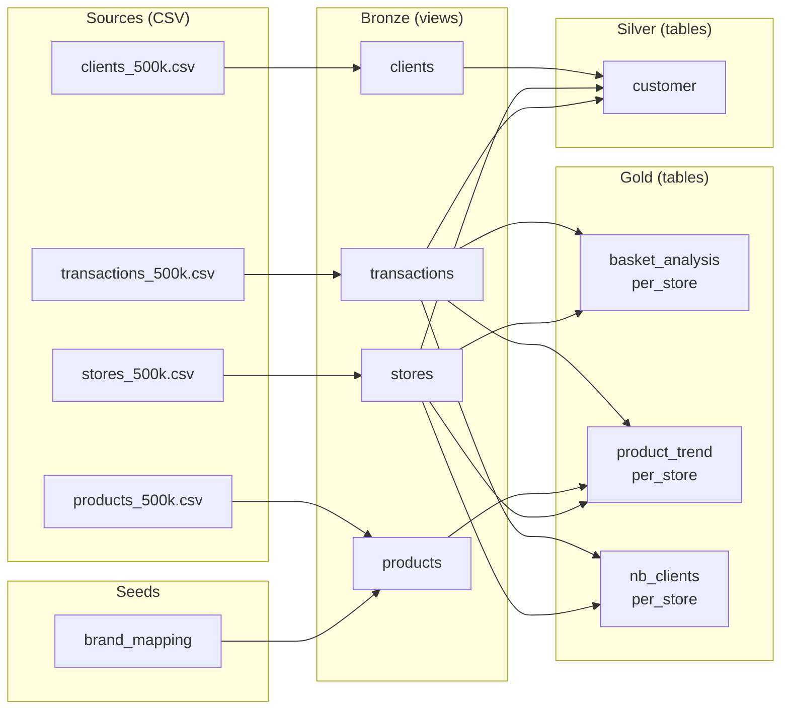

# {: style="height: 1.2em; vertical-align: middle" } dbt Project

dbt transformation layer for the Vusion retail data platform. Implements a medallion architecture (bronze / silver / gold) with full schema documentation, data quality tests, and unit tests. Runs on DuckDB locally and Databricks in production.

!!! tip "Interactive dbt Catalog"

    The auto-generated dbt catalog provides interactive schema exploration, column-level
    lineage, and test coverage details. Run `mise run dev` or `mise run dbt:docs` and
    open **[localhost:8200](http://localhost:8200/){:target="_blank"}**.

    The catalog is generated from the same YAML schema files documented below --
    this page covers architecture and design decisions, while the catalog is best
    for browsing individual columns, tests, and dependencies.

## Dual-Target Architecture

The same dbt SQL runs on **DuckDB** (local dev) and **Databricks** (production). The target is selected by a single flag:

```bash
dbt build --target dev    # DuckDB (default)
dbt build --target prod   # Databricks + Unity Catalog
```

### How data sources are resolved

Bronze models use the `read_source` macro (`macros/read_source.sql`) to dispatch data reading based on the target:

```
┌──────────────────────┐     ┌───────────────────────────────────────────┐
│  DuckDB (local dev)  │     │  Databricks (production)                  │
├──────────────────────┤     ├───────────────────────────────────────────┤
│  read_csv(           │     │  read_files(                              │
│    'data/txn.csv',   │     │    '/FileStore/data/txn.csv',             │
│    header=true,      │     │    format => 'csv',                       │
│    auto_detect=true  │     │    header => 'true'                       │
│  )                   │     │  )                                        │
└──────────────────────┘     └───────────────────────────────────────────┘
```

Both paths use the same `data_path` variable — the only difference is the function:

- **DuckDB**: `read_csv()` with `auto_detect=true`
- **Databricks**: `read_files()` with `format => 'csv'`

The `data_path` variable is set in `dbt_project.yml` (default: `"data"` for local dev) and overridden via `--vars` on Databricks to point to DBFS, Unity Catalog Volumes, or Azure Blob Storage.

Everything above bronze (silver, gold) uses `{{ ref() }}` and is fully adapter-agnostic -- no target-specific code.

### Where output tables are written

| Layer | Local (DuckDB) | Databricks | Materialization |
|-------|---------------|------------|-----------------|
| Bronze | `bronze.*` | `bronze.*` | View |
| Silver | `silver.*` | `silver.*` | Table |
| Gold | `gold.*` | `gold.*` | Table |

Schema names match the medallion layer directly — no prefix. This is controlled by the `generate_schema_name` macro override, which uses the `+schema` value from `dbt_project.yml` without prepending the target schema.

### Configuration files

| File | Purpose |
|------|---------|
| `profiles.yml` | Defines `dev` (DuckDB) and `prod` (Databricks) connection targets |
| `dbt_project.yml` → `vars.data_path` | CSV directory — `"data"` locally, overridden via `--vars` on Databricks |
| `databricks.yml` → `variables.data_path` | Per-target data path: `/FileStore/data` (dev), `abfss://...` (prod) |
| `macros/read_source.sql` | Target-aware dispatch: `read_csv()` on DuckDB, `read_files()` on Databricks |
| `macros/parse_date.sql` | Target-aware date parsing: `try_strptime` on DuckDB, `cast(x as date)` on Databricks |
| `macros/optimize_tables.sql` | OPTIMIZE + Z-ORDER on Databricks, no-op on DuckDB |

## Model Layers

### Lineage



### Bronze

1:1 mappings from source CSVs. Materialized as **views** (no storage cost, always fresh). Each model handles its own data quality fixes:

| Model | Source File | Key Transformations |
|-------|-----------|---------------------|
| `clients` | `clients_500k.csv` | Type casting, nullable `account_id`, null filtering |
| `stores` | `stores_500k.csv` | Store type normalization (`lower(trim(...))`), lat/lng extraction from `latlng` field |
| `products` | `products_500k.csv` | Brand trimming, type casting, null filtering |
| `transactions` | `transactions_500k.csv` | Date normalization, sign correction (quantity drives spend sign), zero-quantity exclusion |

### Silver

Business logic layer. Materialized as **tables** for performance.

**`customer`** -- RFM (Recency, Frequency, Monetary) customer analytics:

- RFM metrics computed from transaction history
- 1-5 scoring scale with fixed thresholds (matching PySpark reference)
- 8 customer segments: Champion, Loyal Customer, At Risk, Lost, Hibernating, Need Attention, About to Sleep, Potential Loyalist
- Customer status (Active/Inactive/Churned) and lifecycle stage (New/Active/Lapsed/Churned)
- Primary store preference with loyalty score (% of transactions at top store)

**Column groups and rationale:**

| Group | Columns | Why |
|-------|---------|-----|
| Identity | `client_id`, `client_name`, `client_job`, `client_email`, `account_id` | Denormalized from bronze `clients` — makes the silver table self-contained for dashboards without re-joining |
| RFM Metrics | `recency_days`, `frequency`, `monetary_value` | The three raw RFM dimensions computed from transactions — foundation for scoring |
| RFM Scores | `recency_score`, `frequency_score`, `monetary_score` | 1-5 scoring using fixed thresholds — enables segment calculation |
| Segmentation | `rfm_segment`, `customer_status`, `customer_lifecycle_stage`, `is_repeat_customer` | Business classifications derived from scores — primary output for marketing dashboards |
| Purchase History | `first_purchase_date`, `last_purchase_date`, `avg_quantity_per_transaction`, `total_transactions` | Temporal and volume context — helps analysts understand purchase patterns |
| Store Preference | `primary_store_id`, `primary_store_type`, `primary_store_transaction_count`, `store_loyalty_score` | Where the customer shops most — enables store-level customer analysis |
| Audit | `created_at`, `updated_at` | Row-level timestamps for incremental refresh tracking |

### Gold

KPI aggregates for dashboards and downstream analytics. Materialized as **tables**. All gold models denormalize store metadata (`store_type`, `latitude`, `longitude`, `opening`, `closing`) so that BI tools can query a single table without additional joins — the standard "wide table" pattern in data warehousing.

**`basket_analysis_per_store`** -- Store-level basket KPIs:

| Group | Columns | Why |
|-------|---------|-----|
| Key | `store_id` | Primary key — one row per store |
| Basket Metrics | `avg_basket_size`, `avg_basket_item_count`, `stddev_basket_size`, `min_basket_size`, `max_basket_size` | Distribution statistics — shows whether baskets are consistent or highly variable |
| Volume | `total_transactions` | Activity level — context for the averages |
| Store Metadata | `store_type`, `latitude`, `longitude`, `opening`, `closing` | Denormalized from bronze `stores` — dashboard-ready |
| Audit | `created_at` | Row-level timestamp |

**`product_trend_per_store`** -- Product sales trends with 30/60/90-day windows:

| Group | Columns | Why |
|-------|---------|-----|
| Composite Key | `store_id`, `product_id` | One row per store-product combination |
| Time Windows | `sales_30d`, `sales_60d`, `sales_90d`, `total_sales_all_time` | Sales volume in progressively wider windows — answers "is this product growing or declining?" |
| Trend Indicators | `trend_direction`, `trend_30d_vs_60d_pct`, `sales_velocity_30d` | Derived signals — the core value of this model. Direction + velocity enable automated reordering decisions |
| Volume | `transaction_count` | Activity context |
| Product Metadata | `brand`, `ean` | Denormalized from bronze `products` — enables brand-level trend analysis |
| Store Metadata | `store_type` | Denormalized — enables filtering by store type |
| Audit | `created_at` | Row-level timestamp |

**`nb_clients_per_store`** -- Client engagement per store:

| Group | Columns | Why |
|-------|---------|-----|
| Key | `store_id` | Primary key — one row per store |
| Client Metrics | `nb_clients`, `avg_transactions_per_client` | Customer penetration and engagement — answers "how many customers visit and how often?" |
| Volume | `total_transactions`, `total_quantity`, `avg_quantity` | Activity level and throughput — context for client metrics |
| Store Metadata | `store_type`, `latitude`, `longitude`, `opening`, `closing` | Denormalized from bronze `stores` — dashboard-ready |
| Audit | `created_at` | Row-level timestamp |

## Data Quality Tests

### Known Issues and Resolutions

The source data contains six known quality issues. All are handled in the bronze layer:

| # | Issue | Where | How It Is Handled | Test Coverage |
|---|-------|-------|-------------------|---------------|
| 1 | Missing `account_id` column | `clients_500k.csv` | Nullable cast in `clients` | Schema test: `account_id` allows null |
| 2 | Inconsistent store type casing | `stores_500k.csv` | `lower(trim(...))` in `stores` | `accepted_values` test on `store_type` |
| 3 | Missing `latitude`/`longitude` columns | `stores_500k.csv` | Fallback to `latlng` string parsing in `stores` | `not_null` (warn) on `latitude`/`longitude` |
| 4 | Inconsistent brand naming | `products_500k.csv` | `trim(...)` in `products` | `not_null` on `brand` |
| 5 | Multiple date formats | `transactions_500k.csv` | `cast(... as date)` in `transactions` | `valid_date_range` generic test, `not_null` on `transaction_date` |
| 6 | Sign inconsistency (quantity vs spend) | `transactions_500k.csv` | Quantity sign drives spend correction in `transactions` | `sign_consistency` generic test, singular sign assertion |

### Test Types

**Schema tests** (defined in YAML):

- `unique`, `not_null` on all primary keys and required fields
- `relationships` on foreign keys (client_id, product_id, store_id) with `warn` severity
- `accepted_values` on categorical fields (store_type, rfm_segment, customer_status, trend_direction)

**Singular tests** (`tests/`):

- `assert_sign_corrected_transactions_have_consistent_signs` -- post-correction, quantity and spend must agree
- `assert_rfm_scores_within_bounds` -- all RFM scores between 1 and 5
- `assert_store_loyalty_score_within_range` -- loyalty score between 0 and 100
- `assert_basket_min_le_max` -- min basket size never exceeds max
- `assert_sales_windows_monotonic` -- sales_30d <= sales_60d <= sales_90d <= total_sales_all_time
- `assert_nb_clients_le_total_transactions` -- a store cannot have more unique clients than transactions
- `assert_gold_stores_exist_in_bronze` -- no orphaned store_ids across gold models
- `assert_avg_transactions_per_client_consistent` -- avg_transactions_per_client = total / nb_clients (within rounding)

**Generic tests** (`tests/generic/`):

- `sign_consistency(column, compare_column)` -- two columns must share the same sign
- `positive_value(column)` -- column must be >= 0
- `valid_date_range(column, min_date, max_date)` -- date must fall within a reasonable range

## Unit Tests

dbt unit tests validate transformation logic with fixed input data.

### Silver (`_silver_unit_tests.yml`)

| Test | What It Validates |
|------|-------------------|
| `test_rfm_segment_champion` | High-frequency, high-recency, high-monetary client is classified as Champion |
| `test_customer_lifecycle_new` | Client with exactly one transaction is classified as New lifecycle stage |
| `test_customer_status_churned` | Client with only old transactions (200+ days) is classified as Churned |

### Gold (`_gold_unit_tests.yml`)

| Test | Model | What It Validates |
|------|-------|-------------------|
| `test_basket_metrics_single_store` | `basket_analysis_per_store` | Avg, min, max, stddev, total for two baskets at one store |
| `test_basket_metrics_multiple_stores` | `basket_analysis_per_store` | Aggregation is correctly partitioned by store_id |
| `test_basket_item_count_distinct_products` | `basket_analysis_per_store` | Counts distinct products per basket, not rows |
| `test_nb_clients_single_store` | `nb_clients_per_store` | Client counting, totals, avg_transactions_per_client |
| `test_nb_clients_multiple_stores` | `nb_clients_per_store` | Same client counted once per store |
| `test_nb_clients_same_client_multiple_transactions` | `nb_clients_per_store` | Repeat visits correctly inflate avg_transactions_per_client |
| `test_trend_increasing` | `product_trend_per_store` | More recent sales than prior window = "Increasing" |
| `test_trend_decreasing` | `product_trend_per_store` | Fewer recent sales than prior window = "Decreasing" |
| `test_trend_stable_no_sales` | `product_trend_per_store` | No recent sales in any window = "Stable" |
| `test_trend_sales_velocity` | `product_trend_per_store` | sales_30d / 30 = correct velocity |
| `test_trend_multiple_products_per_store` | `product_trend_per_store` | Two products at same store produce separate rows |

## Test Coverage Summary

| Layer | Model | Schema | Singular | Unit | Total |
|-------|-------|--------|----------|------|-------|
| Bronze | `clients` | 2 | -- | -- | 2 |
| Bronze | `stores` | 5 | -- | -- | 5 |
| Bronze | `products` | 3 | -- | -- | 3 |
| Bronze | `transactions` | 12 | 1 | -- | 13 |
| Silver | `customer` | 14 | 2 | 3 | 19 |
| Gold | `basket_analysis_per_store` | 13 | 1 | 3 | 17 |
| Gold | `product_trend_per_store` | 18 | 1 | 5 | 24 |
| Gold | `nb_clients_per_store` | 14 | 2 | 3 | 19 |
| | | | | | |
| **Total** | **8 models** | **81** | **8** (incl. 1 cross-model) | **14** | **103+** |

!!! note "Test counts"

    Schema test counts include `unique`, `not_null`, `relationships`, `accepted_values`,
    and custom generic tests (`positive_value`, `valid_date_range`, `sign_consistency`).
    The actual total is higher (117 items in `dbt build`) because some tests are shared
    across models and the seed is counted separately.

Run unit tests:

```bash
mise run dbt:test
```

## Table Optimization Policy

Delta Lake optimization for Databricks production. Implemented as a dbt macro in `macros/optimize_tables.sql` (no-op on DuckDB). Runs **weekly** (Sunday 05:00 Europe/Paris) via a standalone Databricks job (`deep_rayon_optimize`), decoupled from the daily dbt pipeline to avoid unnecessary compaction overhead.

| Table | Z-ORDER Columns | Partitioning | Rationale |
|-------|----------------|--------------|-----------|
| `customer` | `client_id`, `rfm_segment`, `customer_status` | None | 500K rows; Z-ORDER sufficient for filter/join queries |
| `basket_analysis_per_store` | `store_id`, `store_type` | None | Small aggregate; fits in a few files |
| `product_trend_per_store` | `store_id`, `product_id`, `trend_direction` | None | Aggregate; multi-column filter patterns |
| `nb_clients_per_store` | `store_id`, `store_type` | None | Small aggregate |
| `transactions` (if materialized) | `transaction_date`, `client_id`, `store_id` | `PARTITION BY (transaction_date)` | Largest table; date partitioning for time-range queries |

**Why weekly, not daily:**

- OPTIMIZE compacts small files and applies Z-ORDER — an expensive operation on large tables
- Running after every dbt build wastes compute without meaningful query performance improvement
- Weekly is the standard cadence for Delta maintenance at scale (billions of rows)
- The optimization job is independently schedulable — frequency can be adjusted without touching the dbt pipeline

**Scaling considerations:**

- At billions of rows, partition transactions by month (truncated date) to avoid over-partitioning
- Evaluate liquid clustering as a Z-ORDER replacement for more adaptive data organization
- Run VACUUM after OPTIMIZE to reclaim storage from stale files

## How to Run Locally

```bash
# Install tools
mise install

# Bootstrap dependencies
mise run setup

# Full build (models + all tests)
mise run dbt

# Models only (skip tests)
mise run dbt:run

# Tests only (requires models to be built)
mise run dbt:test

# Generate and serve dbt docs (localhost:8200)
mise run dbt:docs
```

### Profiles

- **dev** (default): DuckDB at `target/deep_rayon.duckdb`. Zero-config, file-based. Used by `mise run dbt`.
- **prod** (manual use only): Databricks + Unity Catalog. Requires `DATABRICKS_HOST`, `DATABRICKS_HTTP_PATH`, `DATABRICKS_TOKEN` environment variables. For local testing against a Databricks workspace.
- **databricks_cluster** (auto-generated): When running as a Databricks `dbt_task`, Databricks ignores `profiles.yml` and auto-generates its own profile using the `warehouse_id` from the job task config. No `--target` flag is needed in the job commands.
