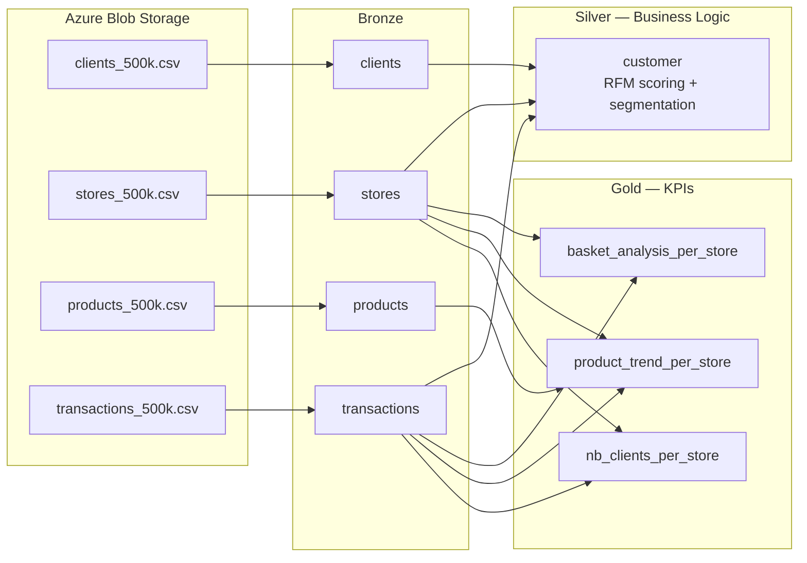

# Vusion Data Platform

Production-grade retail data pipeline for [Vusion](https://www.vfrench.tech/), migrating a PySpark ETL to **dbt + Databricks** with a medallion architecture (Bronze / Silver / Gold).

## Architecture



| Layer | Models | Materialization | Purpose |
|-------|--------|-----------------|---------|
| **Bronze** | `clients`, `stores`, `products`, `transactions` | View | 1:1 with source CSVs. Type casting, date normalization, sign correction. |
| **Silver** | `customer` | Table | RFM scoring, customer segmentation, lifecycle status, store loyalty. |
| **Gold** | `basket_analysis_per_store`, `product_trend_per_store`, `nb_clients_per_store` | Table | Store-level KPIs ready for dashboards and downstream analytics. |

## Quick Start

```bash
mise install          # Python 3.12, uv, mprocs
mise run setup        # Sync deps + pre-commit hooks
mise run dbt          # Build all models + run tests (DuckDB)
mise run dev          # Start docs + dbt-docs + Airflow (mprocs)
```

| Service | URL | Command |
|---------|-----|---------|
| MkDocs | [localhost:8100](http://localhost:8100) | `mise run docs` |
| dbt docs | [localhost:8200](http://localhost:8200) | `mise run dbt:docs` |
| Airflow | [localhost:8080](http://localhost:8080) (admin/admin) | `mise run airflow` |

## Key Design Decisions

- **dbt-first** — all transformations are SQL models; PySpark is reference only
- **Dual-target** — same SQL runs on DuckDB (dev) and Databricks (prod); Databricks-specific features wrapped in target-aware macros
- **Data quality as code** — 55 data tests (45 schema, 7 generic, 3 singular), 3 unit tests
- **Orchestration-only Airflow** — submits Databricks jobs, never runs dbt itself
- **Databricks Asset Bundle** — declarative YAML with dev/prod targets, deployed via CI/CD

## Data Quality

Six known issues handled in the bronze layer:

| Issue | Source | Resolution |
|-------|--------|------------|
| Missing `account_id` column | `clients_500k.csv` | Nullable cast |
| Inconsistent store type casing | `stores_500k.csv` | `lower(trim(...))` |
| Missing `latitude`/`longitude` columns | `stores_500k.csv` | Fallback to `latlng` parsing |
| Inconsistent brand naming | `products_500k.csv` | `trim(...)` normalization |
| Multiple date formats | `transactions_500k.csv` | `cast(... as date)` normalization |
| Sign inconsistency (quantity vs spend) | `transactions_500k.csv` | Sign correction with flag |

## Bug Fix

The original PySpark contains a join error in `product_trend_per_store` (line 265 of [`gold_datamart_kpis.py`](https://github.com/pierreWagou/vusion/blob/main/reference/pipeline/gold_datamart_kpis.py#L265)):

```python
# ORIGINAL (buggy): joins stores on product_id instead of store_id
.join(stores_df.select("id", "type"), F.col("store_id") == F.col("product_id"), "left")
```

Fixed in the dbt model:

```sql
-- FIXED: join stores on store_id
left join stores s on wt.store_id = s.store_id
```

## CI/CD

| Pipeline | Trigger | Steps |
|----------|---------|-------|
| **CI** | Push/PR to main | Ruff lint → dbt build → MkDocs build → bundle validate |
| **CD** | Merge to main | MkDocs deploy (GitHub Pages) → Databricks bundle deploy (prod) |

## Project Structure

```
vusion/
├── dbt_project/           # dbt models, tests, macros, schema docs
├── airflow/               # Airflow DAG + Docker Compose for local dev
├── reference/             # Original PySpark pipeline + test instructions
├── databricks.yml         # Databricks Asset Bundle config
├── resources/             # Bundle job definition
├── benchmarks/            # Query performance benchmarks (Databricks wheel)
├── data/                  # Source CSV files (500K rows each)
├── docs/                  # MkDocs site content
├── .github/               # CI/CD workflows (lint, test, build, deploy)
├── pyproject.toml         # Python deps (dbt, duckdb, pytest)
├── mise.toml              # Tool versions + task runner
└── mkdocs.yml             # Documentation site config
```
